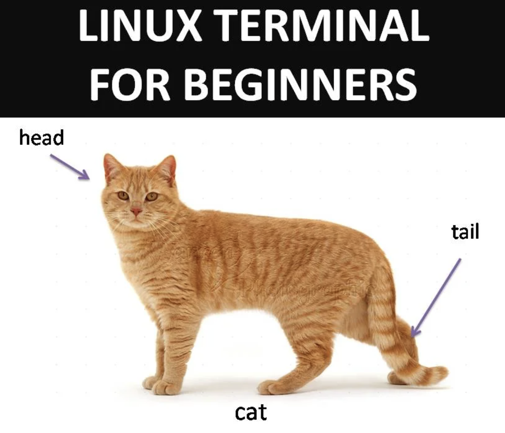

# Files and Redirection

Linux is the land of files. Everything is a file. While this is a bit of a broad generalization, many aspects of the linux operating system can be treated like a file: connections, terminals, devices, symbolic links and even... files. Before we harness the powers all things file-like, let's learn how to interact with... files.

## Navigation

Print working (current) directory

`pwd`

Show current directory contents

`ls`

Make a directory

`mkdir mynewdir`

Change directory

`cd mynewdir`

Print working directory

`pwd`

Change directory up one level

`cd ..`

Print working directory

`pwd`

Change directory to home directory

`cd ~`

Print working directory

`pwd`

## Files

Create an empty file

`touch myfile`

Investigate a file type

`file myfile`

Copy file to new file

`cp myfile mynewfile`

Move new file to new director

`mv mynewfile mynewdir`

Delete empty file

`rm myfile`

## Using cat 

Show first file:

`cat cars1.md`

Show second file:

`cat cars2.md`

Combine files using cat:

`cat cars1.md cars2.md > cars3.md`

Display new file using less command:

`less cars3.md`

Show the first 10 lines:

`head cars3.md`

Show the last 10 lines:

`tail cars3.md`

Count the number of lines, words, and bytes respectively:

`wc cars3.md`

## Redirection

Redirection allows us to control where the output of executed commands is sent. There are three areas of concern:

STDIN

STDOUT 

STDERR

